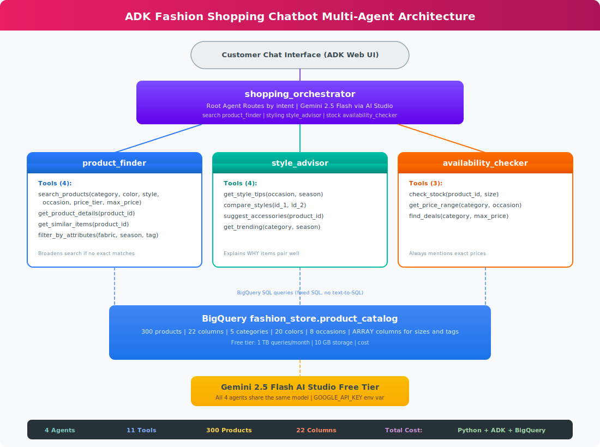
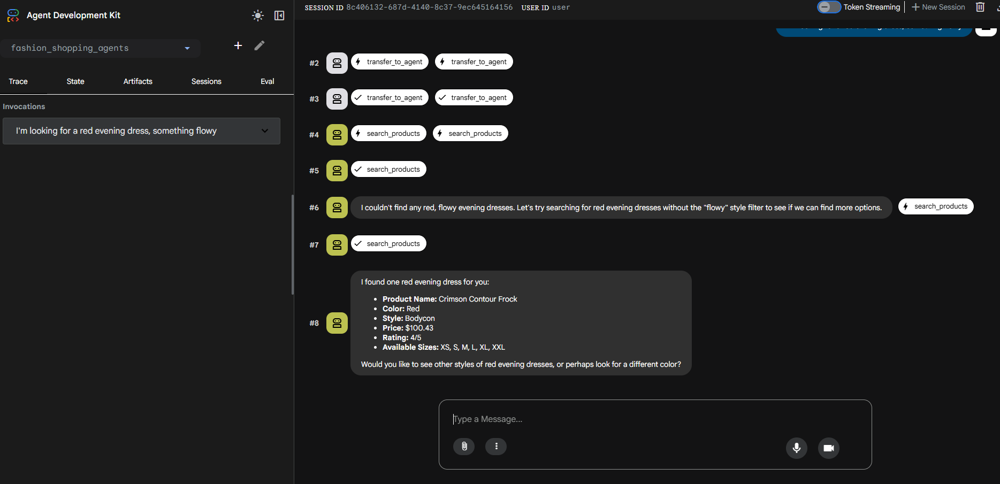
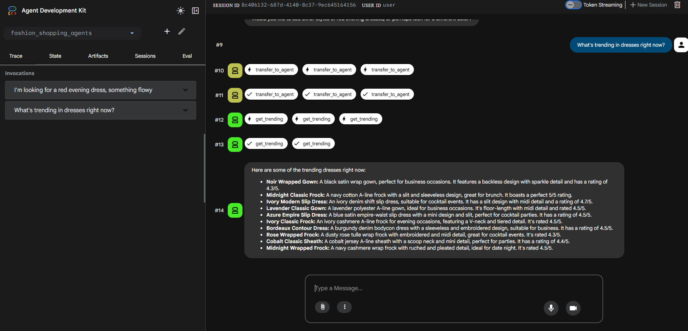
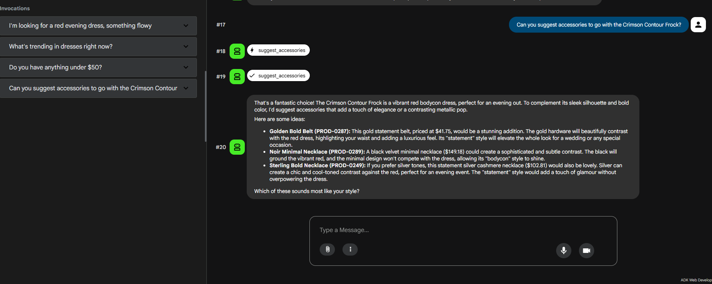
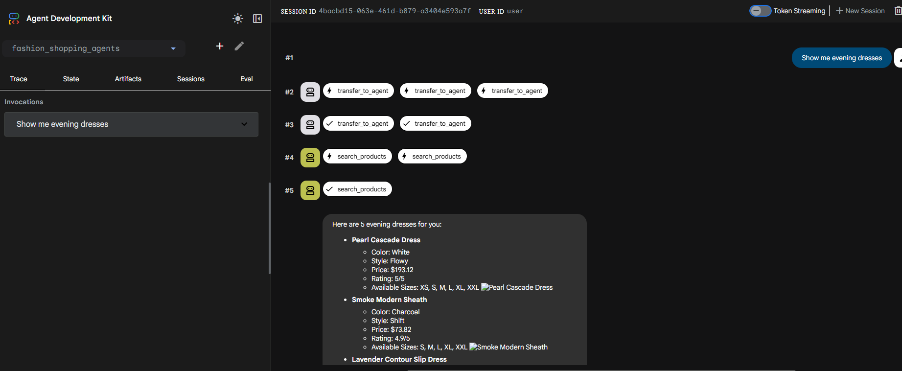
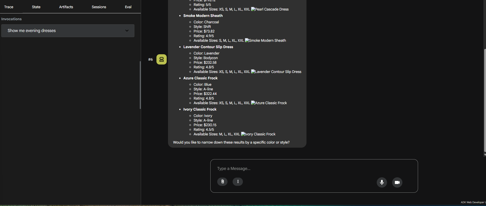

# ADK Fashion Shopping Chatbot

A conversational AI shopping assistant built with **Google ADK**, **Gemini 2.5 Flash**, and **BigQuery**. Customers describe what they want in natural language, and the multi-agent system searches a product catalog, provides styling advice, and checks availability - all through conversation.

**Total cost: ** - AI Studio free tier + BigQuery free tier.

## Architecture

**4 agents, 11 tools, 300 products, 22 columns.**

| Agent | Role | Tools |
|-------|------|-------|
| shopping_orchestrator | Root agent - routes by intent | transfer_to_agent |
| product_finder | Searches catalog, finds similar items | search_products, get_product_details, get_similar_items, filter_by_attributes |
| style_advisor | Styling advice, comparisons, accessories, trends | get_style_tips, compare_styles, suggest_accessories, get_trending |
| availability_checker | Stock, sizes, pricing, deals | check_stock, get_price_range, find_deals |

## How It Works

1. Customer types a message: *"I need a red evening dress, something flowy"*
2. Root orchestrator detects **search intent** and transfers to product_finder
3. Product finder calls search_products(category="dress", color="red", occasion="evening", style="flowy")
4. If no exact matches, agent **broadens the search** automatically (drops "flowy" filter)
5. Presents results conversationally with ratings, prices, and available sizes
6. Customer refines: *"What about accessories?"* and routes to style_advisor
7. Style advisor calls suggest_accessories(product_id) and explains WHY each pairs well

## Tech Stack

| Component | Technology | Cost |
|-----------|-----------|------|
| Agent Framework | Google ADK (Agent Development Kit) | Free |
| LLM | Gemini 2.5 Flash via AI Studio | Free tier |
| Database | BigQuery (fashion_store.product_catalog) | Free tier |
| Language | Python 3.12 | Free |
| Chat Interface | ADK Web UI (adk web .) | Built-in |

## Product Catalog

300 synthetic fashion products across 5 categories:

| Category | Count | Styles | Price Range |
|----------|-------|--------|-------------|
| Dresses | 80 | flowy, fitted, a-line, bodycon, wrap, empire_waist, shift | 45-350 |
| Tops | 55 | relaxed, fitted, oversized, cropped, peplum | 25-150 |
| Pants | 55 | slim, wide_leg, bootcut, straight, tapered | 35-200 |
| Jackets | 55 | fitted, oversized, cropped, longline, structured | 55-400 |
| Accessories | 55 | statement, minimal, classic, boho, modern | 15-250 |

**Schema highlights:** 20 colors, 8 occasions, 14 fabrics, ARRAY columns for size_available and tags (queried with UNNEST).

## Quick Start

### Prerequisites
- GCP project with BigQuery enabled
- AI Studio API key (https://aistudio.google.com/apikey)
- Python 3.10+

### Setup

git clone https://github.com/gbhorne/adk-fashion-chatbot.git
cd adk-fashion-chatbot

pip install google-adk google-cloud-bigquery

export GOOGLE_API_KEY="your-key-here"
gcloud config set project YOUR_PROJECT_ID

bq mk --dataset fashion_store

python generate_products.py
bq load --source_format=NEWLINE_DELIMITED_JSON fashion_store.product_catalog products.json

adk web .

Open Web Preview on port 8000 and start chatting.

## Screenshots

### Search Broadening - Agent drops filters when no exact match found

### Trending Dresses - Style advisor surfaces top-rated items

### Budget Query - Contextual response within conversation

### Accessory Suggestions - Explains WHY items pair well

### Evening Dress Search - Full trace showing agent routing

### Search Results - Products with ratings, prices, and sizes

## Verification

68/68 checks passed.

## Key Design Decisions

1. **Multi-agent over monolithic** - Specialist agents with focused tool sets produce more accurate routing and responses
2. **Fixed SQL with parameters over text-to-SQL** - Security (no injection), reliability, predictable cost
3. **BigQuery ARRAY columns** - UNNEST for sizes and tags avoids join tables, leverages BigQuery columnar strengths
4. **AI Studio free tier** - Same Gemini 2.5 Flash model, zero cost, sufficient for POC
5. **Automatic search broadening** - When no exact matches, agent drops filters one at a time and explains what it did
6. **Single denormalized table** - 22 columns, no joins needed, optimized for BigQuery architecture

## License

MIT
